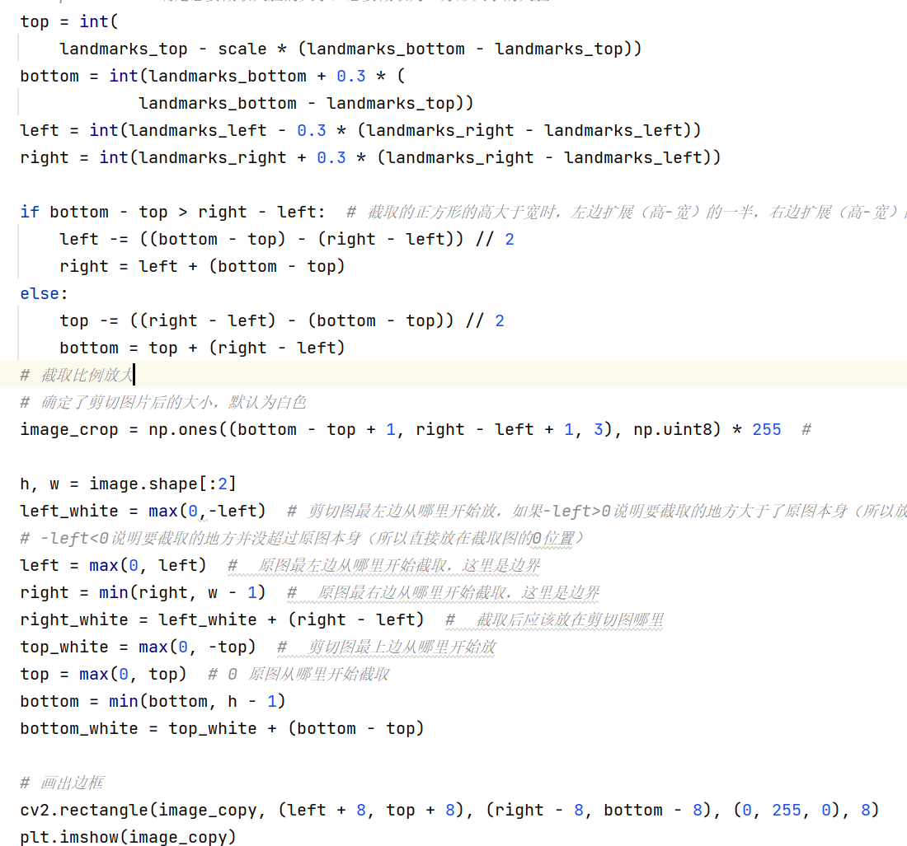

# GANForCartoon 应用设计文档

## 1. 项目概述
本项目旨在开发一个能够将真实人像转换为卡通风格的网页。该网页使用深度学习模型来识别和分割人脸，然后将分割后的图像转换为卡通风格。

## 2. 功能描述
- **人脸检测与裁剪**：使用 `FaceDetect` 类检测图像中的人脸，并按指定比例裁剪。
- **人脸分割**：利用 U2Net 模型对裁剪后的人脸进行分割，生成人脸掩码。
- **背景替换**：将分割后的人脸的背景替换为白色。
- **风格迁移**：使用 Photo2Cartoon 模型将白色背景的人脸图像转换为卡通风格。

## 3. 依赖
- 需要预先训练好的 U2Net 和 Photo2Cartoon 模型。
- 需要安装所有依赖库。

## 4. 参数设置
- `--img-name`：指定要处理的图像名称。
- `--shear-rate`：指定裁剪人脸时的比例。
- `--segment-model`：指定使用的分割模型。
- `--migration-method`：指定风格迁移的方法。

## 5. 项目原理简介
项目主要分为图像预处理和卡通图像风格迁移两个部分。
## 图像预处理部分(小组成员：洪武凯)
图像预处理包括人脸关键点检测、人脸矫正、人脸截取部分
### 1. 人脸关键点检测
人脸关键点检测，获得人脸的68个关键点坐标，并将人脸中的68个点用蓝色点进行标记
实现代码如图：

实现效果如图：

### 2. 人脸矫正
通过68个人脸关键点的第37、46两个点（即眼角的两个点）的坐标结合仿射变换，将倾斜的人脸转正。
将眼睛的两个点连成一条线，为仿射变换做准备，随后通过这条直线若是倾斜，则将进行仿射变换，背景填充为白色
- 关键代码

- 实现效果如图

### 3. 人脸截取
人脸截取，根据68个关键点中最左边，最右边，最上边，最下边的四个点的坐标位置形成一个正方形截取出人脸，为了不单单只截取出一张脸，所以要适当增大正方形的面积，让一个大正方形将人头截取出来
- 关键代码

- 过程图：
- 其中红色正方形框为通过四个点形成的截取人脸的框，绿色的框为调整后截取出人头的框
- 
- 最后展现出截取出的人头图
- 

## 卡通图像风格迁移部分(小组成员：张晋豫)
- 风格迁移部分分为两个部分，首先将人脸与背景中进行分割出来，然后将将去除背景后的人像送入卡通风格迁移模型进行风格迁移
### 1. 人脸与背景分割
- 加载U2Net模型并对面部图像进行分割，它初始化U2Net模型，加载模型参数，并将模型设置为评估模式。在模型准备好之后，它通过数据加载器遍历每个图像，将图像输入模型，获取预测结果,并调用save_output函数来保存和处理这些结果.save_output函数的作用是将模型的预测结果转换成图像格式，并保存到指定的目录,还将图像转换为灰度图和二值图的步骤，最后显示并返回这个二值图像。
- 关键代码
- 
- 实现效果
- 
- 然后用原图与截取后的图像相乘就能去除掉背景，得到白色背景的人脸图像。
- 实现代码
- 
- 实现效果
- 

### 2. 风格迁移
- 将去除背景后的人像送入卡通风格迁移模型进行风格迁移。
- 加载预训练的模型Photo2Cartoon。 使用模型对输入的人脸图像进行转换，得到卡通图像。
- 关键代码
- 
- 实现效果
- 
  
## 6.项目成果展示
- 最终使用 Flask 框架的 Python Web 应用程序，用于将用户上传的图像转换为卡通风格。
### 后端flask框架
- 定义 Flask 应用实例和配置：设置上传的文件保存的目录，处理后的图像保存的目录，允许上传的文件扩展名。调用 main.py 中的函数进行图像处理。保存处理后的图像到 IMAGE_FOLDER。渲染模板显示原始图像和卡通化后的图像。
- 关键代码
- 
### 前端页面和展示效果
- 用户上传图像，点击转换按钮，将图像转换为卡通风格。
- 
- 展示效果，展示处理过程中的最关键的步骤，以及最终的结果。
- 